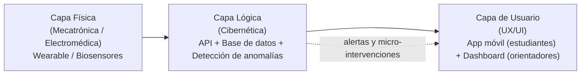

🧠 NeuroSync

**Hackathon Nicaragua 2026 · Categoría Aficionado · Temática: Salud**

> Ecosistema ciber-físico para la detección temprana y pasiva de riesgos en la salud mental.

---

 📌 Datos del reto

| Campo | Detalle |
|---|---|
| Categoría | Aficionado |
| Temática | Salud |
| Reto | Mente sana |
| Equipo | *CultivaData* |


💡 El problema

La salud mental sigue siendo un tema poco abordado de forma preventiva, especialmente en entornos educativos. El estigma y la desinformación impiden que jóvenes y adultos identifiquen señales tempranas de ansiedad o depresión, y los métodos actuales dependen del auto-reporte del usuario, que suele ser tardío e impreciso.

 🛠 Nuestra solución

**NeuroSync** integra hardware (wearables o biosensores) para monitorear indicadores fisiológicos —frecuencia cardíaca y respuesta galvánica de la piel— en lugar de depender de cuestionarios. Un algoritmo analiza esos datos y:

- Alerta tempranamente a los orientadores sobre episodios de estrés prolongado.
- Envía micro-intervenciones al usuario (ej. ejercicios de respiración) en el momento oportuno.
- Reduce el estigma al hacer el monitoreo pasivo y objetivo, no un formulario que llenar.

 🏗 Arquitectura

El proyecto se organiza en tres capas, alineadas a los perfiles de ingeniería del equipo:



1. **Capa Física** — captura de datos biométricos (real o simulada).
2. **Capa Lógica** — recepción, almacenamiento y análisis de los datos; algoritmo de detección de anomalías.
3. **Capa de Usuario** — interfaz para estudiantes (móvil) y dashboard analítico para orientadores (web).

 📂 Estructura del repositorio

```
NeuroSync/
├── app_web/            # Interfaz de usuario (frontend: app móvil + dashboard)
├── api_backend/         # Lógica de procesamiento, API y base de datos
├── simulador_hardware/  # Scripts que simulan la transmisión de datos biométricos
├── docs/                # Wireframes y documentación técnica
└── README.md
```

Cada carpeta tiene su propio `README.md` con el detalle de lo que va dentro.
 👥 Equipo

| Nombre | Rol / Disciplina |
|---|---|
| *(nombre)* | Mecatrónica / Electromédica — hardware |
| *(nombre)* | Cibernética — backend / lógica |
| *(nombre)* | UX/UI — frontend |
| *(nombre)* | Líder de equipo |

 ✅ Estado del Sprint 1 (31 de julio, 2026)

- [ ] Video pitch de 1 minuto grabado y subido a YouTube
- [ ] Product Backlog / tablero Kanban actualizado
- [ ] Repositorio de GitHub inicializado con colaboradores agregados

🎯 Impacto esperado

Promover el bienestar emocional mediante una herramienta accesible y dinámica que facilite la identificación temprana de riesgos, reduzca el estigma y fortalezca el autocuidado, mejorando el acceso a orientación y apoyo oportuno.

---

